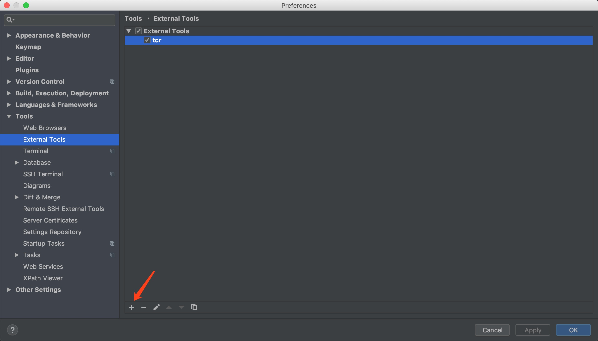

## What is TCR? 
- https://medium.com/@kentbeck_7670/test-commit-revert-870bbd756864
- https://medium.com/@tdeniffel/tcr-test-commit-revert-a-test-alternative-to-tdd-6e6b03c22bec

## How use?

Ok, you can enter shortcut running tcr shell.

