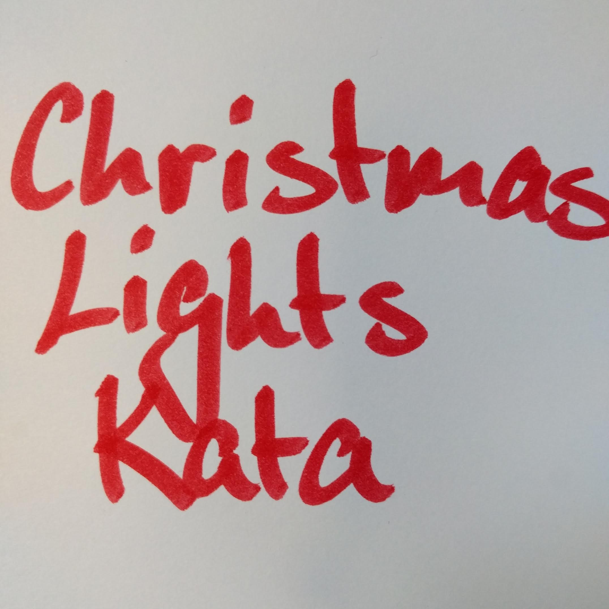

## Christmas Lights Kata



**Probably a Fire Hazard**

Because your neighbors keep defeating you in the holiday house decorating contest year after year, you’ve decided to deploy one million lights in a 1000x1000 grid. Furthermore, because you’ve been especially nice this year, Santa has mailed you instructions on how to display the ideal lighting configuration. Lights in your grid are numbered from 0 to 999 in each direction; the lights at each corner are at 0,0, 0,999, 999,999, and 999,0. The instructions include whether to turn on, turn off, or toggle various inclusive ranges given as coordinate pairs. Each coordinate pair represents opposite corners of a rectangle, inclusive; a coordinate pair like 0,0 through 2,2 therefore refers to 9 lights in a 3x3 square. The lights all start turned off. To defeat your neighbors this year, all you have to do is set up your lights by doing the instructions Santa sent you in order.

turn on 0,0 through 999,999 would turn on (or leave on) every light.
toggle 0,0 through 999,0 would toggle the first line of 1000 lights, turning off the ones that were on, and turning on the ones that were off.
turn off 499,499 through 500,500 would turn off (or leave off) the middle four lights.
After following the instructions, how many lights are lit?

Part Two
You just finish implementing your winning light pattern when you realize you mistranslated Santa’s message from Ancient Nordic Elvish. The light grid you bought actually has individual brightness controls; each light can have a brightness of zero or more. The lights all start at zero.

The phrase turn on actually means that you should increase the brightness of those lights by 1.
The phrase turn off actually means that you should decrease the brightness of those lights by 1, to a minimum of zero.
The phrase toggle actually means that you should increase the brightness of those lights by 2.
What is the total brightness of all lights combined after following Santa’s instructions?

For example:

turn on 0,0 through 0,0 would increase the total brightness by 1.
toggle 0,0 through 999,999 would increase the total brightness by 2000000.

## 案例分析

1000 x 1000 的矩阵中一共有一百万盏灯。

### Part one
1. turn on 0,0 through 999,999 would turn on (or leave on) every light.
2. toggle 0,0 through 999,0 would toggle the first line of 1000 lights, turning off the ones that were on, and turning on the ones that were off.
3. turn off 499,499 through 500,500 would turn off (or leave off) the middle four lights.
After following the instructions, how many lights are lit?

### Part two

turn on 一盏灯亮度 +1。
toggle 一盏灯亮度 +2。
turn off 的灯亮度 -1，亮度最小为 0。

For example:

1. turn on 0,0 through 0,0 would increase the total brightness by 1.
2. toggle 0,0 through 999,999 would increase the total brightness by 2000000.

## 程序设计
```java
class ChristmasLight {
    public void turnOn(Score scope);
    public void turnOff(Score scope);
    public void toggle(Score scope);
    public Integer getLights();
    public Integer totalBrightness();
}
```

## 任务分解
- [x] 验证 turn on [0,0]~[2,2]总共有9盏亮灯。
- [x] 验证 turn on [0,0]~[2,2]，然后 turn off [1,1]~[2,2]，剩下5盏亮灯。
- [x] 验证 turn on [0,0]~[2,2]，紧接着 toggle [1,1]~[2,2]，最后 turn off [0,0]~[2,2]，总共剩下4盏亮灯。
- [x] 验证 turn on [0,0]~[2,2]，紧接着 toggle [1,1]~[2,2]，最后 turn off [3,3]~[4,4]，总共剩下9盏亮灯。
- [x] 验证 turn on [0,0]~[2,2]，然后 toggle [1,1]~[2,2]，总亮度为 17。
- [x] 验证 turn on [0,0]~[999,999]，总共有1000000盏亮灯。
- [x] 验证 turn on [0,0]~[999,999]，然后 toggle [0,0]~[999,0]，紧接着 turn off [0,0]~[999,999]，再 turn on [0,1]~[999,999]，再 turn off [499,499]~[500,500]，总共剩下 999996 盏亮灯。
- [x] 验证 turn on [0,0]~[999,999]，然后 toggle [0,0]~[999,0]，紧接着 turn off [0,0]~[999,999]，再 turn on [0,1]~[999,999]，再 turn off [499,499]~[500,500]，总亮度为: 1000996。


