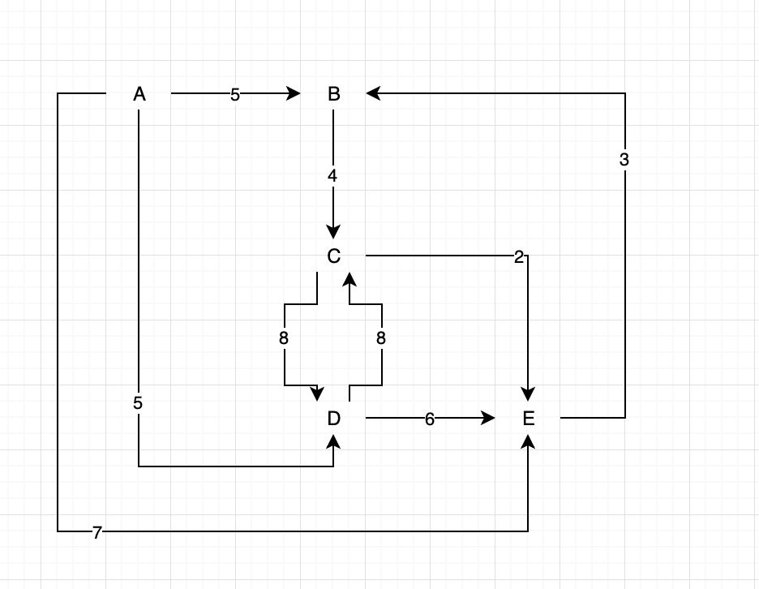

## Trains

The local commuter railroad services a number of towns inKiwiland.  
Because of monetary concerns, all of the tracks are 'one-way.' 
That is, a route from Kaitaia to Invercargill does not imply the existence of a route from Invercargill to Kaitaia.  
In fact, even if both of these routes do happen to exist, they are distinct and are not necessarily the same distance!

The purpose of this problem is to help the railroad provide its customers with information about the routes.  
In particular, you will compute the distance along a certain route, 
the number of different routes between two towns, and the shortest route between two towns.

Input: A directed graph where a node represents a town and an edge represents a route between two towns.  
The weighting of the edge represents the distance between the two towns.  A given route will never appear more than once, 
and for a given route, the starting and ending town will not be the same town.

Output:For test input 1 through 5, if no such route exists, output 'NO SUCH ROUTE'. 
Otherwise, follow the route as given; do not make any extra stops! For example, 
then directly to city C (a distance of4).
the first problem means to start at city A, then travel directly to city B (a distance of 5), 

1.    The distance of the route A-B-C.

2.    The distance of the route A-D.

3.    The distance of the route A-D-C.

4.    The distance of the route A-E-B-C-D.

5.    The distance of the route A-E-D.

6.    The number of trips starting at C and ending at C with a maximum of 3 stops.  In the sample data below,there are two such trips: C-D-C (2 stops). and C-E-B-C (3 stops).

7.    The number of trips starting at A and ending at C with exactly 4 stops.  In the sample data below, there are three such trips: A to C (via B,C,D); A to C (via D,C,D); and A to C (viaD,E,B).

8.    The length of the shortest route(in terms of distance to travel) from A to C.

9.    The length of the shortest route(in terms of distance to travel) from B to B.

10. The number of different routes from C to C with a distance of less than 30.  In the sample data, the trips are: CDC, CEBC, CEBCDC, CDCEBC, CDEBC, CEBCEBC, CEBCEBCEBC.

Test Input:

For the test input, the towns are named using the first few letters of the alphabet from A to D.  A route between two towns (A to B)with a distance of 5 is represented as AB5.

Graph: AB5, BC4, CD8, DC8, DE6, AD5, CE2, EB3, AE7

Expected Output:

Output #1: 9

Output #2: 5

Output #3: 13

Output #4: 22

Output #5: NO SUCH ROUTE

Output #6: 2

Output #7: 3

Output #8: 9

Output #9: 9

Output #10: 7

## 任务分解
- [x] 创建测试数据。
- [x] 在给定的测试数据的情境下，验证 A-B-C 路线的距离必须等于 9。
- [x] 在给定的测试数据的情境下，验证 A-D 路线的距离必须等于 5。
- [x] 在给定的测试数据的情境下，验证 A-D-C 路线的距离必须等于 13。
- [x] 在给定的测试数据的情境下，验证 A-E-B-C-D 路线的距离必须等于 22。
- [x] 在给定的测试数据的情境下，没有 A-E-D 路线。
- [x] 在给定的测试数据的情境下，并且每条路线不超过 3 个站点，计算 C-C 路线一共有 C-D-C 和 C-E-B-C 两条路线。
- [x] 在给定的测试数据的情境下，并且每条路线必须经过 4 个站点，计算 A-C 路线一共有 A-B-C-D-C、A-D-C-D-C 和 A-D-E-B-C 三条路线。
- [x] 在给定的测试数据的情境下，验证 A-C 的最短距离等于 9。
- [x] 在给定的测试数据的情境下，验证 B-B 的最短距离等于 9。
- [x] 在给定的测试数据的情境下，并且距离小于30，验证 C-C 包含 CDC, CEBC, CEBCDC, CDCEBC, CDEBC, CEBCEBC, CEBCEBCEBC 七种不同的路线。
- [x] 同一条路线不能出现一次以上。
- [x] 同一条路线不会出现起点和终点相同。
- [x] 重构 PointToPointDistanceRouteStrategy 和 PointToPointShortestRouteStrategy
